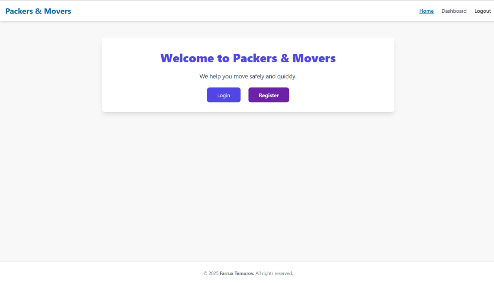
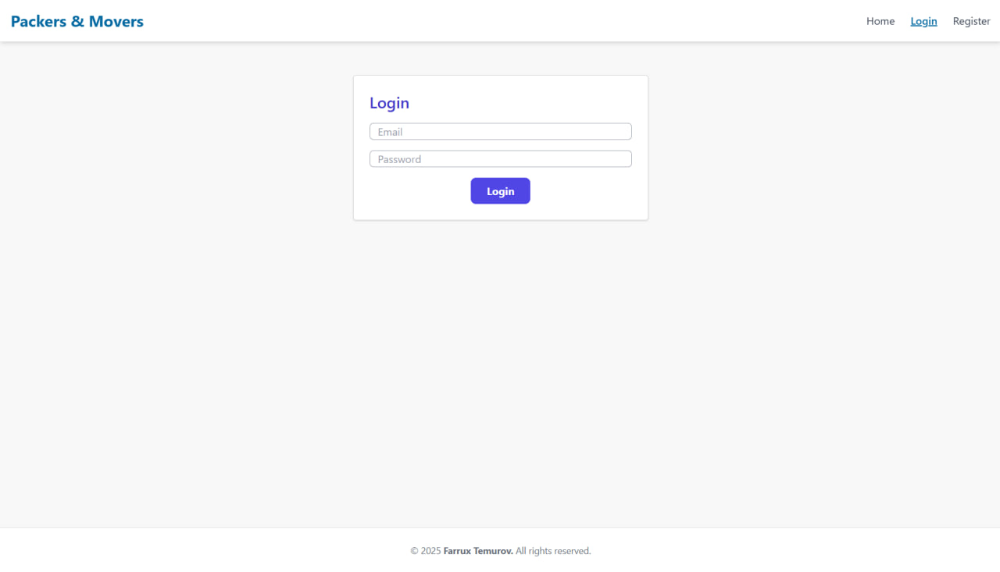
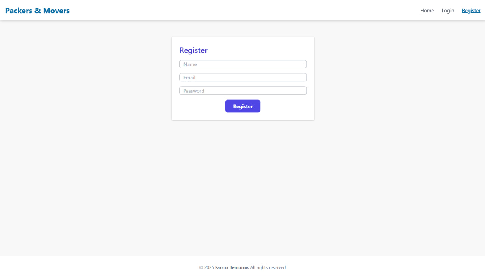
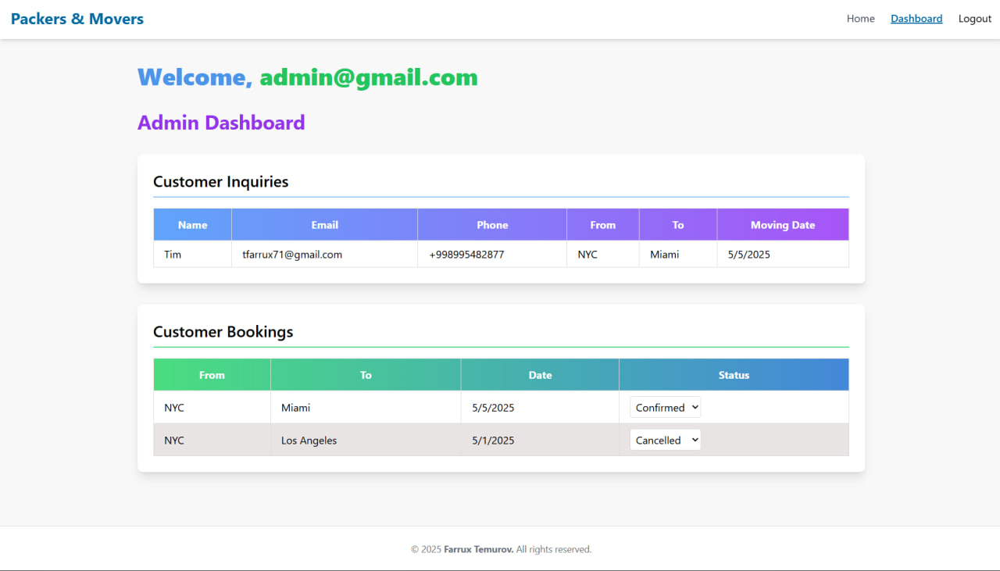
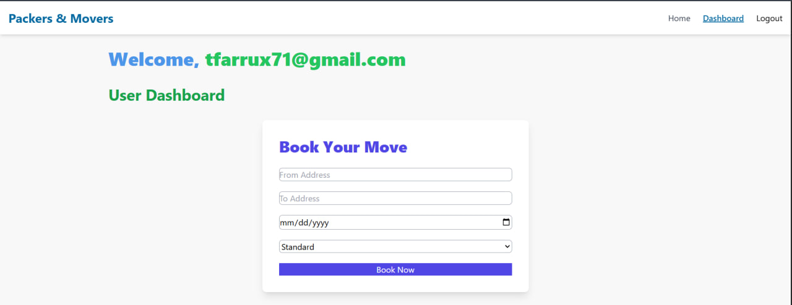
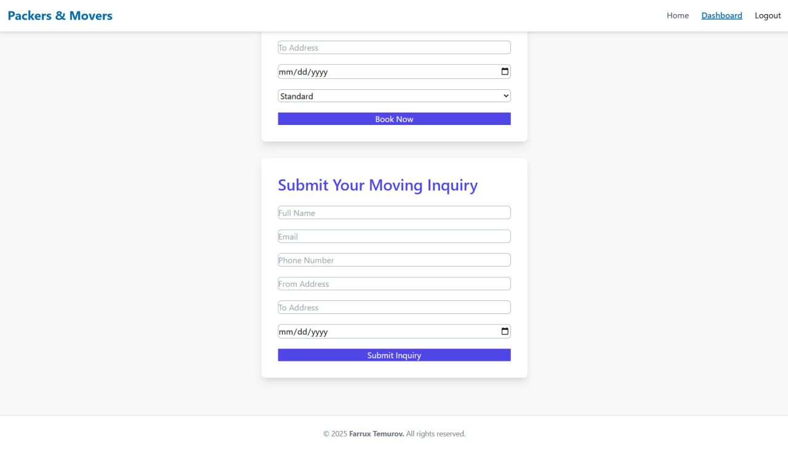

# Packers & Movers

A full-stack **Packers & Movers** application built with **React** on the frontend and **Express.js** on the backend. This app helps users book moving services and allows admins to manage inquiries and bookings efficiently.

---

## 📌 Features

- **User Authentication:** Register, login, and protected routes for users and admins.  
- **Dashboard Views:** Separate dashboards for users and admins.  
- **Booking Management:** Users can make bookings; admins can view and update booking statuses.  
- **Inquiry Management:** Admins can handle inquiries via a table view.  
- **Responsive Frontend:** Built with React and Tailwind CSS for a modern UI.  
- **API Handling:** Axios used for API calls, react-toastify provides real-time feedback.  
- **Clean Code Structure:** Separation of concerns with components, pages, context, and API utilities.

---

## 🖼 Screenshots

### Home Page


### Login Page


### Register Page


### Admin Dashboard


### User Dashboard 1


### User Dashboard 2


---

## 💻 Tech Stack

- **Frontend:** React, Vite, Tailwind CSS, React Router DOM, Axios, react-toastify  
- **Backend:** Node.js, Express.js, MongoDB, bcryptjs, jsonwebtoken, cors, helmet, dotenv  

---

## 🚀 Getting Started

### 1. Clone the repository
```bash
git clone https://github.com/your-username/packers-and-movers.git
cd packers-and-movers
cd backend
npm install
```
### 2. Create a .env file with:
```
PORT=9090
MONGO_URI=your_mongodb_connection_string
JWT_SECRET=your_secret_key
npm start
```
### 3. Frontend Setup
```
cd ../frontend
npm install
npm run dev
```
Visit http://localhost:5173 to see the app.

